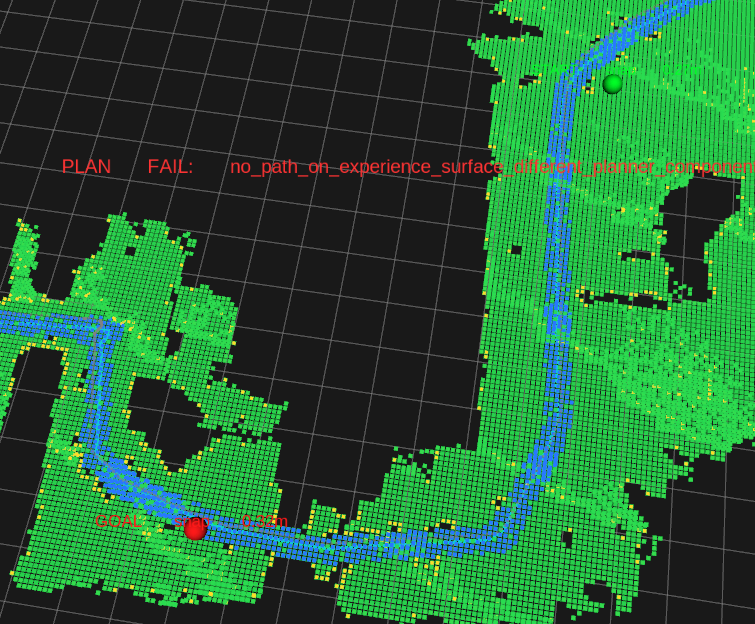
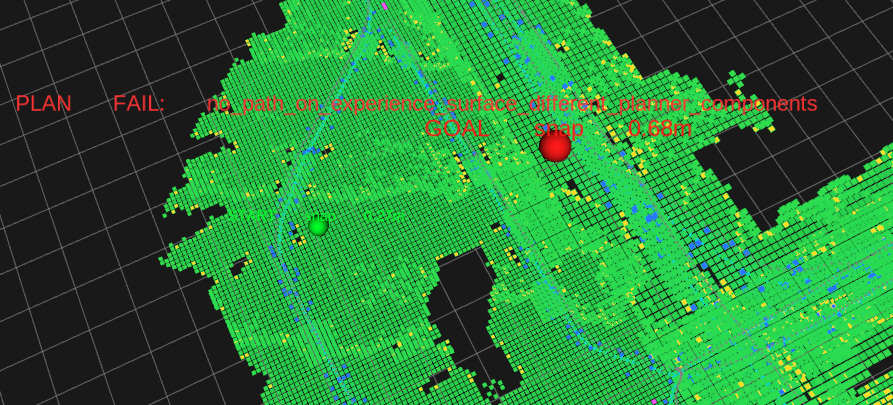
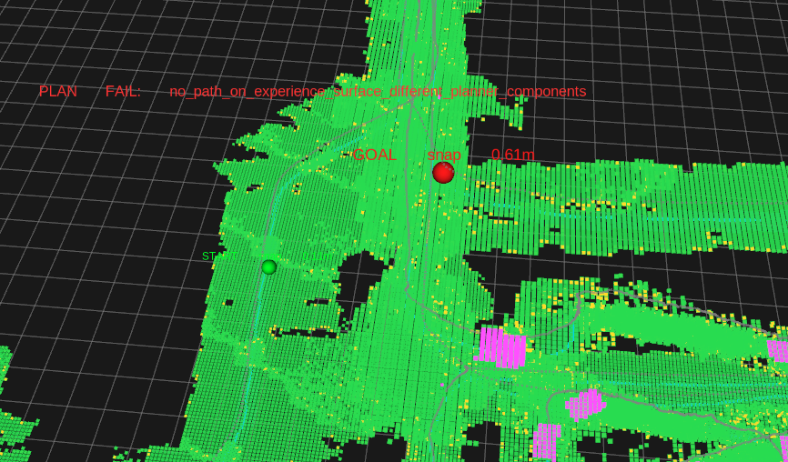
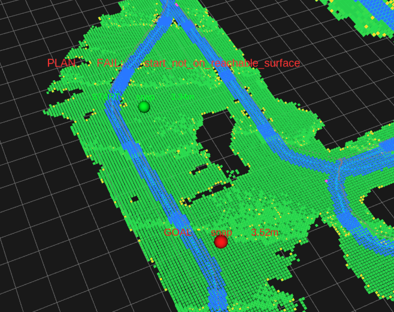

# TGW Multi-Floor Surface Graph Connector Review

## Prompt For GPT Pro

Please review this as a robotics planning / graph construction problem, not as
parameter tuning.

TGW is now a pbstream experience planner:

```text
N3Mapping n3map.pbstream
  -> dense optimized trajectory + keyframe clouds
  -> experience reachable surface
  -> layered 2D surface graph
  -> graph A*
```

The planner should not return to:

```text
3D voxel A*
realtime raycast mapping
PCD fallback
StairFlight / semantic stair model
global_map.pcd fallback
```

The core question:

```text
How should true cross-floor connectivity be represented in the Layered 2D
Surface Graph so that:

1. same-floor reachable surfaces remain connected when local movement is valid;
2. illegal multi-meter vertical jumps are impossible;
3. real walked stair/ramp gaps can be connected by dense-trajectory evidence;
4. bridge cells do not become lateral expansion anchors;
5. graph A* searches only explicit valid surface/bridge edges?
```

Please focus on concrete implementation guidance for:

```text
TrajectoryProjector
ExperienceSurfaceBuilder / ExperienceSnapshot
ExperienceSurfaceGraph
SurfaceAstarPlanner
debug topics / stats_json / logs
tests
```

## Current Branch And Commits

Repository:

```text
/home/user/ros_ws/to_migrate_ws/src/tgw_planner
```

Branch:

```text
feature/pbstream-experience-reset
```

Relevant latest pushed commits:

```text
2262609 Allow layer-safe graph edges across support lineage
631ffbd Log snapped surface graph endpoints
d6e1589 Use glog file diagnostics for TGW planner
bae4b37 Add ordered bridge connectors for surface graph
1921f4a Make experience surface graph layer safe
```

## Attached RViz Images

The relevant RViz screenshots are stored with this question document.

Image 1:



```text
Same-floor query failure from the latest RViz run.
RViz text:
PLAN FAIL: no_path_on_experience_surface_different_planner_components
GOAL snap about 0.32m

Visual symptom:
start and goal are both on the low-floor green reachable surface. They appear
connected by reachable/traversable cloud, but the planner reported different
planner components.
```

Image 2:



```text
Cross-floor query failure after layer-safe graph.
RViz text:
PLAN FAIL: no_path_on_experience_surface_different_planner_components
GOAL snap about 0.68m

Visual symptom:
start is on lower floor, goal is on upper floor. Both snap to reachable
surfaces, but planner reports different components. This is the remaining
problem to solve.
```

Additional historical reference images:



```text
Earlier same-floor component split screenshot with GOAL snap about 0.61m.
This class of failure is expected to be fixed by commit 2262609.
```



```text
Earlier snap-distance failure before snap bounds were changed to XY-only.
This is not the current remaining issue.
```

## Verified Logs For The Two Screenshots

The current glog path is:

```text
src/tgw_planner/logs/
```

Relevant log file:

```text
logs/tgw_experience_planner_node.jammy.user.log.INFO.20260609-115524.539129
logs/tgw_experience_planner_node.jammy.user.log.WARNING.20260609-115538.539129
```

Load summary:

```text
loaded n3map experience resource
keyframes=799
dense_trajectory=10649
raw_geometry=836844
support_candidates=313173
projected_support=10579
observed_seed=41542
bridge_seed=526
expanded_reachable=164899
planner_components=2234
largest_planner_component=62191
planner_multifloor_components=0
rejected_projection=70
no_support=70
ambiguous_multifloor=0
bridge_used_as_expansion_anchor=0
support_components=6144
anchored_components=95
footprint_rejected=1
body_obstructed_rejected=154056
hole_filled=28771
```

First query, same-floor failure before the latest fix:

```text
reason=no_path_on_experience_surface_different_planner_components

clicked_start=(0.883019, -24.1057, 3.5)
snapped_start=(1.15, -24.15, 0.163751)
start_node=32481
start_component=10
start_snap_xy_m=0.270635

clicked_goal=(-6.03045, -35.4196, 3.5)
snapped_goal=(-5.85, -35.15, -0.284244)
goal_node=110942
goal_component=11
goal_snap_xy_m=0.32441
```

Second query, true cross-floor failure:

```text
reason=no_path_on_experience_surface_different_planner_components

clicked_start=(0.883019, -24.1057, 3.5)
snapped_start=(1.15, -24.15, 0.163751)
start_node=32481
start_component=10
start_snap_xy_m=0.270635

clicked_goal=(4.64744, -28.1251, 9.7)
snapped_goal=(4.15, -27.65, 8.15791)
goal_node=87558
goal_component=5
goal_snap_xy_m=0.687843
```

Important note:

```text
snap distance is now XY-only.
z is used only to select the highest surface below the clicked point.
```

## What Was Fixed In 2262609

Before `2262609`, normal graph edges required:

```text
from.support_component_id == to.support_component_id
```

This was too strict. It prevented valid local movement between neighboring
surface graph nodes if they came from different anchored support-lineage ids.
That split same-floor reachable areas into different planner components.

Probe evidence before the fix:

```text
component 10 and component 11 had 1945 adjacent XY candidate pairs.
SurfaceTransitionValidator allowed 2 of those local transitions.
Graph still rejected them because support_component_id differed.
```

The fix changed normal edge semantics:

```text
normal edge requires:
  both endpoints have anchored support lineage (support_component_id >= 0)
  true SurfaceNode.z dz is within normal edge policy
  slope policy passes
  SurfaceTransitionValidator passes

normal edge no longer requires:
  same support_component_id
```

This keeps unanchored/ceiling-like surfaces out, but avoids cutting one real
floor into many graph components.

## Probe Result After 2262609

Temporary local helper:

```text
/tmp/tgw_component_probe.cpp
```

It rebuilds:

```text
/tmp/tgw_n3map_nav_filtered.pbstream
  -> ExperienceSurfaceBuilder
  -> ExperienceSurfaceGraph
```

Probe output after `2262609`:

```text
graph nodes 154186
components 1966
edges 1150179
cross_reject 66516
dz_reject 1005138
slope_reject 2734
invalid_bridge_reject 3106

node 32481
  point 1.15 -24.15 0.163751
  graph_component 10
  support_component 6
  clearance 0.45
  bridge 0
  degree 8

node 110942
  point -5.85 -35.15 -0.284244
  graph_component 10
  support_component 3
  clearance 0.45
  bridge 0
  degree 8

node 87558
  point 4.15 -27.65 8.15791
  graph_component 5
  support_component 4
  clearance 0.45
  bridge 0
  degree 8

component 10
  size 79707
  z_min -1.09301
  z_max 0.939479
  z_range 2.03249
  bridge_nodes 0
  support_components 6:49444 3:28598 154:1117 1355:150 19:139

component 5
  size 62191
  z_min 7.2335
  z_max 8.32854
  z_range 1.09504
  bridge_nodes 161
  support_components 4:62030 -1:161
```

Plan probe:

```text
plan_probe 32481_to_110942
  success true
  message path found
  waypoints 145
  expanded 18947
  max_edge_dz 0.260066
  layer_jump_edges 0

plan_probe 32481_to_87558
  success false
  message no_path_on_experience_surface_different_components
  waypoints 0
  expanded 0
```

Interpretation:

```text
Same-floor graph over-splitting is fixed.
True cross-floor connectivity is still missing.
```

## Remaining Problem

The lower-floor start node and upper-floor goal node still fall into different
planner components:

```text
start component: 10
goal component: 5
```

Probe result for component 10 -> component 5:

```text
cross_component_probe 10 5
checked 368113 adjacent-XY candidates
validator_allowed_near_xy 0
best_neighbor_dz 6.90038
best_nodes 153316 39734
```

This means:

```text
There is no valid normal surface edge between the lower and upper planner
components.

The closest adjacent-XY candidate would require about a 6.9m z jump, which must
remain illegal.
```

So the remaining issue is not:

```text
snap distance
A* iteration budget
same-floor graph connectivity
```

The remaining issue is:

```text
The system has not built a valid explicit cross-floor connector from dense
trajectory evidence.
```

## Current Bridge State

Current graph metrics:

```text
component 5 bridge_nodes 161
invalid_bridge_reject 3106
```

This shows bridge nodes exist, but they do not connect lower component 10 to
upper component 5.

Potential reasons to review:

```text
1. Trajectory bridge segments are generated only for short local projection gaps,
   not for the full walked stair/ramp connector.

2. Bridge endpoint attachment requires intended entry/exit support components,
   but the lower/upper support components for the actual stair traversal may not
   be discovered or matched correctly.

3. The dense trajectory along the stair may project partly onto missing point
   cloud, so there is no sequence of accepted projected support samples suitable
   as bridge endpoints.

4. Bridge cells are present on the upper component, but not as an ordered chain
   from lower observed support to upper observed support.

5. The builder may need a separate trajectory connector extraction pass, rather
   than relying only on local projection-gap bridge cells.
```

## Desired First-Principles Design

The global planner should remain:

```text
Layered 2D Surface Graph
```

Search state:

```text
SurfaceNodeId
```

Not:

```text
GridIndex{x,y,z} dz lattice
```

Normal edges:

```text
local XY adjacency
true SurfaceNode.z continuity
slope/step policy
footprint / transition validator
anchored support lineage exists
```

Bridge / connector edges:

```text
explicit ordered connector evidence from dense trajectory
not free local adjacency
not lateral expansion
not a support anchor
not a generic low-confidence surface
```

## Main Questions For Review

1. Should TGW introduce a first-class `TrajectoryConnector` separate from
   short-gap `TrajectoryBridgeSegment`?

   Possible shape:

   ```cpp
   struct TrajectoryConnector {
     int connector_id;
     std::vector<ProjectedOrInferredTrajectorySample> ordered_samples;
     SurfaceNodeId entry_node;
     SurfaceNodeId exit_node;
     int entry_component_id;
     int exit_component_id;
     double length_m;
     double z_delta_m;
     double max_step_dz_m;
     double confidence;
   };
   ```

2. Should connector extraction operate directly on dense trajectory samples,
   not only on missing projection gaps?

   The robot physically walked the stair. If keyframe point cloud is sparse on
   the stair, the connector may need to derive a narrow passable corridor from
   the optimized dense trajectory itself.

3. What is the safe rule for connector endpoints?

   Current bridge endpoint attachment is strict:

   ```text
   bridge endpoint can attach only to intended entry/exit support component
   ```

   But if the intended support component is not discovered due to sparse stair
   point cloud, how should endpoints be selected without reintroducing false
   ceiling/upper-plane links?

4. Should connector edges bypass normal `SurfaceTransitionValidator` footprint
   checks inside the missing geometry zone, while still bounding:

   ```text
   connector width
   max segment dz
   slope along trajectory
   body collision against raw geometry
   endpoint attachment safety
   ```

5. How should RViz debug expose this?

   Useful debug layers may include:

   ```text
   /tgw_experience/connector_candidate_cloud
   /tgw_experience/connector_endpoint_cloud
   /tgw_experience/accepted_connector_edge_cloud
   /tgw_experience/rejected_connector_cloud
   /tgw_experience/component_gap_cloud
   ```

6. What stats should prove the fix?

   Candidate stats:

   ```json
   {
     "trajectory_connectors": 0,
     "accepted_trajectory_connectors": 0,
     "rejected_trajectory_connectors": 0,
     "connector_edges": 0,
     "connector_component_links": 0,
     "max_connector_segment_dz_m": 0.0,
     "max_path_edge_dz_m": 0.0,
     "path_layer_jump_edges": 0
   }
   ```

## Acceptance Criteria

Same-floor query:

```text
start_node=32481
goal_node=110942
must succeed
must have path_layer_jump_edges=0
must keep max_path_edge_dz_m bounded
```

Cross-floor query:

```text
start_node=32481
goal_node=87558
should succeed only if there is an explicit valid trajectory connector.
It must not succeed by creating a normal edge with multi-meter dz.
```

Safety invariants:

```text
No 3D voxel A*
No generic z-neighbor expansion
No global_map.pcd fallback
No realtime raycast fallback
No StairFlight semantic route
No bridge lateral expansion
No normal graph edge with multi-meter dz
No path with path_layer_jump_edges > 0
```

## Current Recommendation

Do not tune these upward to force success:

```text
plan_max_step_height_m
max_trajectory_bridge_height_delta_m
plan_max_iterations
graph_bridge_attach_max_dz_m
```

That would likely recreate the invalid vertical layer jumps.

The next clean implementation should be:

```text
1. Keep normal graph edges layer-safe and support-lineage anchored.
2. Add a first-class dense-trajectory connector extraction pass.
3. Represent connector chains explicitly in ExperienceSnapshot.
4. Let ExperienceSurfaceGraph add connector edges only from ordered connector
   metadata.
5. Keep connector edges narrow, ordered, bounded, and debuggable.
6. Prove same-floor and cross-floor queries separately.
```
